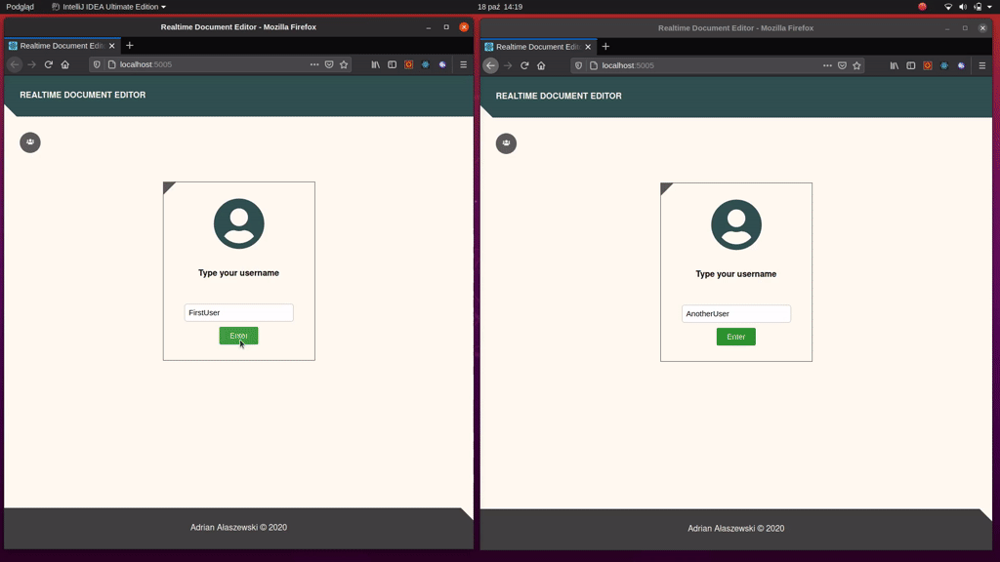

# Realtime document editor

### Goal
My goal was to make a simple one-page app with some interaction and styling.
 

### Tech stack
* Node.js 
* Express.js
* React
* Websocket

### Feature demonstration:

### Features
* Realtime text and user update
* Choosing name
* Simple text styling
* RWD
* Support for many users
* Fancy animations

### Issues
Unfortunately there are some bugs with the editor due to using an outdated component,
but since the main purpose of the project is just to practice coding, and it works well enough, I kept it as it is.

### How to run?
Just start the Node.js server by following command: `node index` at _server_ directory. It already has a build version, so no need for a new client build.
By default, it runs the server at http://localhost:5005.
